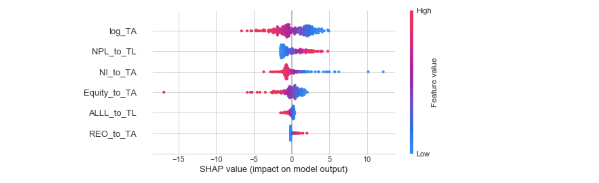

# Modeling bank default with Machine Learning and interpreting the results with SHAP values

**Bank_Default_Modeling** attempts to model banking failures. The data was extracted from the Federal Deposit Insurance Corporation in the U.S. (FDIC) which is in charge of analyzing the stability of the banks and declaring whether a bank defaults or not. Some of the most common reasons to close a bank include: capital inadequacy, violations of financial rules, and management failures.

Financial institutions are more difficult to model than corporations because they have a higher leverage and a more complex debt structure. Although the information is available, the FDIC does not make available its models for bank failure prediction. Therefore, modeling bank default is an important task. This notebook compares logistic regression (1:default and 0:no default) and neural networks (Keras and Tensorflow) to predict bank failure. Logistic Regression proved to have the best accuracy.

**Bank_Default_Shap_values** attempts to interpret the results from Logistic Regression. Machine Learning models are usually treated as blackboxes. To address this issue, SHAP values bring global and local interpretability to the models. 

